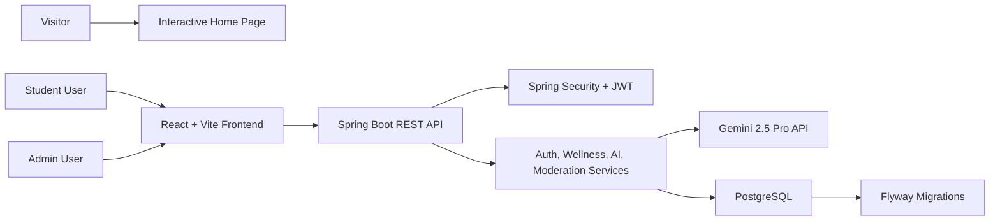

# Architecture Diagram

```mermaid
flowchart LR
  Visitor["Visitor"] --> Home["Interactive Home Page"]
  Student["Student User"] --> React["React + Vite Frontend"]
  Admin["Admin User"] --> React
  React --> API["Spring Boot REST API"]
  API --> Security["Spring Security + JWT"]
  API --> Services["Auth, Wellness, AI, Moderation Services"]
  Services --> Gemini["Gemini 2.5 Pro API"]
  Services --> Postgres["PostgreSQL"]
  Postgres --> Flyway["Flyway Migrations"]
```
