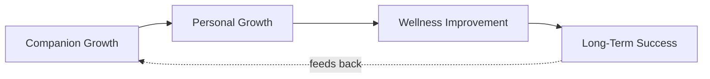
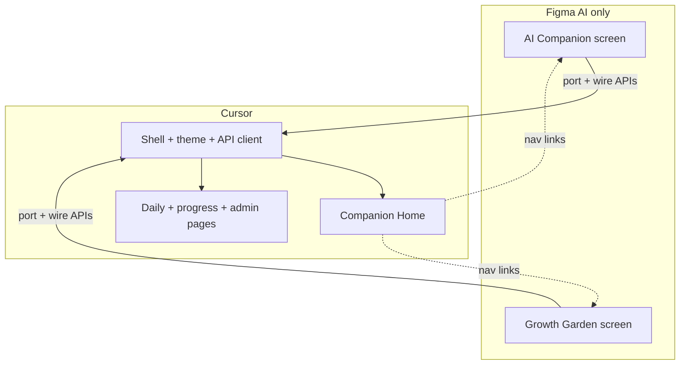
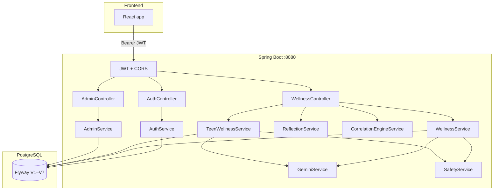

# MindMate Frontend Context Plan

This document is the single reference for building (or rebuilding) the MindMate frontend against the Spring Boot backend.

**Last updated:** June 2026  
**Figma Make (reference only):** [Mindmate](https://www.figma.com/make/yju2Ft3eiAzEp4QOROGt9o/Mindmate) — use **Figma AI for 2 screens only** (see §2)  
**Default build tool:** **Cursor** for all other UI  
**API source of truth:** `WellnessController.java`, `AuthController.java`, `AdminController.java`, `AppDtos.java` (not `api-documentation.md` alone)

---

## 1. Product philosophy (north star)

### What MindMate is

**MindMate is not a productivity dashboard.**

**MindMate is a digital growth companion.**

Every screen, interaction, and reward should answer: *“How does this bring the user closer to their companion—and through that, to themselves?”*

### How users should feel

| Feeling | What the UI must do |
|---------|---------------------|
| **Supported** | Companion acknowledges effort, struggle, and context—not just metrics |
| **Encouraged** | Warm, forward-looking copy; celebrate small wins before pushing “more” |
| **Rewarded** | XP, bond, evolution, garden growth tied to *relationship*, not task completion alone |
| **Understood** | Insights reference *their* check-ins, journals, and patterns—not generic tips |

### The companion is the emotional center

- **Luna** (or the user’s chosen companion) is always visible or one tap away: sidebar widget, hero on home, reactions after actions.
- Chat, `insight`, bond level, mood, and evolution are **primary UI**, not sidebar decoration.
- Analytics and charts exist to help the companion *explain* growth—not to replace conversation.

### Growth flywheel (every module connects here)



| Stage | Meaning in product | Example UI moment |
|-------|-------------------|-------------------|
| **Companion growth** | Bond, XP, level, evolution, garden tied to companion | “Luna gained +15 bond XP for your check-in” |
| **Personal growth** | Habits, goals, reflections, future-me letters | “Luna noticed you’ve journaled 3 days in a row” |
| **Wellness improvement** | Check-ins, sleep, stress, mood trends | “Your wellness score rose—Luna is proud” |
| **Long-term success** | Exams, goals, streaks, badges | “Luna’s plan for Calculus this week” |

**Rule:** After any user action (check-in, habit toggle, journal save, exam log), show a **companion reaction** (copy + optional XP/bond) before or alongside raw numbers.

### What to avoid (anti-patterns)

- Task-manager layouts that lead with empty checklists and bury the companion
- Cold dashboards: metric grids without companion voice
- “Productivity” language: deadlines, throughput, efficiency as hero copy
- Charts with no companion interpretation line
- Features that feel disconnected (e.g. analytics with no link to chat or insight)

### Product summary (scope & safety)

MindMate supports **students** through reflective wellness: check-ins, habits, journaling, gratitude, goals, exam focus, gamification, and bounded AI conversation—with the **companion relationship** as the through-line.

- MindMate is **not** a therapist and must not claim to diagnose, treat, cure, prescribe, or give medical advice.
- Pre-login marketing chat stays **mocked** (no visitor data).
- Authenticated chat uses Gemini when `GEMINI_API_KEY` is set; otherwise a safe local fallback.
- Crisis phrases trigger logged events and generic escalation guidance.

---

## 2. Build workflow: Figma AI vs Cursor

### Rule

| Tool | Scope |
|------|--------|
| **Figma AI** (Figma Make) | **Only** these two experiences |
| **Cursor** | **Everything else** — layout, auth, home, daily modules, admin, shared components |

Do **not** port full Figma Make pages (e.g. `DashboardView`, `Layout`) into the repo. Use Make as visual reference for tokens and companion/garden UX only where noted below.

### Figma AI — build these in Figma, then integrate in Cursor

| # | Module | Route | Figma / MCP | After export |
|---|--------|-------|-------------|--------------|
| 1 | **AI Companion** | `/companion` (or `/app/companion`) | Design + iterate in [Figma Make](https://www.figma.com/make/yju2Ft3eiAzEp4QOROGt9o/Mindmate); `get_design_context` with `fileKey: yju2Ft3eiAzEp4QOROGt9o` | Port into `frontend/src/pages/companion/`; wire `GET/POST /api/companion`, `POST /api/chat`, `GET /api/chat/history` |
| 2 | **Growth Garden** | `/garden` | Same Make file; garden-specific screens/components | Port into `frontend/src/pages/garden/`; wire `GET /api/gamification/progress`, `POST /api/gamification/theme` |

**Companion-related assets from Make you may reuse when integrating those two screens:**

- `LunaCat.tsx` (SVG) — import into companion module, not re-draw in Cursor unless needed
- Companion hero / chat / bond UI patterns from Make — **only** inside AI Companion (and garden if shared)

### Cursor — build these directly (no Figma AI generation)

| Area | Routes / artifacts |
|------|-------------------|
| App shell | `Layout`, sidebar, header, Luna mini-widget, routing |
| Auth | `/login`, `/register`, forgot/reset password |
| Companion Home | `/` or `/app/home` — **built in Cursor** (companion-first layout per §9; not a Figma port of `DashboardView`) |
| Daily loop | Check-in, habits, journal, gratitude |
| Progress | Goals, badges, exams |
| Intelligence | Analytics, reflections, future-me |
| Account | Profile, settings, moderation consent |
| Admin | Users, moderation, crisis events |
| Shared | `lib/api.ts`, `theme.css` (tokens aligned with §8.2), shadcn/ui as needed, post-action companion toasts |

### Workflow diagram



### Handoff checklist (Figma → repo)

When a Figma AI screen is ready:

1. Export or copy generated TSX into the matching `frontend/src/pages/*` folder.
2. Replace mock data with `apiFetch` / hooks from `lib/api.ts`.
3. Match shared tokens from `theme.css` (Cursor-owned); do not fork conflicting colors.
4. Register route in `routes.tsx` under the same app shell as Cursor-built pages.
5. Add post-action companion reactions from **shell** or shared component — garden/companion pages own their internal UX only.

---

## 3. Stack alignment

| Layer | Technology |
|-------|------------|
| Backend | Java 21 (Docker) / 17 (pom), Spring Boot 3.4, JWT, Flyway, PostgreSQL |
| API base | `VITE_API_BASE_URL` (`http://localhost:8088` locally) |
| Target frontend | React, Vite, Tailwind 4, React Router 7, Recharts, lucide-react |
| Figma Make stack | React 18, TypeScript, shadcn/Radix, `motion`, same router/charts |
| Existing repo frontend | `frontend/src/App.jsx` (~4k lines, JSX, partial API wiring) |

**Recommendation:** Modular React in Cursor (`lib/api.ts`, page folders); migrate API logic from `App.jsx`. Import **only** Figma-generated code for §2 companion + garden screens.

---

## 4. Backend architecture



### 4.1 Security

| Route pattern | Access |
|---------------|--------|
| `POST /api/auth/**` | Public |
| `GET /actuator/health` | Public |
| `/api/admin/**` | JWT + `ROLE_ADMIN` |
| All other `/api/**` | JWT required |

**CORS origins:** `http://localhost:5173`, `http://localhost:3000`

**Headers for protected calls:**

```http
Authorization: Bearer <token>
Content-Type: application/json
```

### 4.2 Environment variables

| Variable | Purpose |
|----------|---------|
| `DATABASE_URL`, `DATABASE_USERNAME`, `DATABASE_PASSWORD` | Postgres |
| `JWT_SECRET` | Token signing (change in production) |
| `GEMINI_API_KEY` | Live AI (optional in dev) |
| `GEMINI_MODEL` | Default `gemini-2.5-pro` |
| `VITE_API_BASE_URL` | Frontend to backend URL (e.g. `http://localhost:8088` locally) |

### 4.3 Seed users

| Email | Password | Role |
|-------|----------|------|
| `student@mindmate.local` | `password` | STUDENT |
| `admin@mindmate.local` | `password` | ADMIN |

---

## 5. Authentication contract

### Register

`POST /api/auth/register`

```json
{ "name": "string", "email": "string", "password": "string" }
```

### Login

`POST /api/auth/login`

```json
{ "email": "string", "password": "string" }
```

### Response (both)

```json
{
  "token": "jwt-string",
  "id": 1,
  "name": "Student Demo",
  "email": "student@mindmate.local",
  "role": "STUDENT"
}
```

### Password reset

- `POST /api/auth/forgot-password` -> `{ "message": "..." }`; reset tokens are never returned in API responses.
- `POST /api/auth/reset-password` -> `{ "token": "...", "newPassword": "..." }`

### Frontend session storage

Store at minimum: `token`, `role`, `name`, `email`. On `401` / `403`, clear session and redirect to `/login`.

---

## 6. API reference (complete)

Base URL: `VITE_API_BASE_URL` (`http://localhost:8088` locally)

### 6.1 Core wellness

| Method | Path | Body / notes |
|--------|------|----------------|
| POST | `/api/moods` | `{ "mood": "EXCELLENT" \| "GOOD" \| "NEUTRAL" \| "STRESSED" \| "SAD" }` |
| GET | `/api/moods` | List of mood entries |
| POST | `/api/journals` | `{ "title", "content" }` → AI adds `summary`, `keyConcerns`, `emotion` |
| GET | `/api/journals` | List |
| GET | `/api/journals/{id}` | Single (filtered from list) |
| PUT | `/api/journals/{id}` | Update + re-run AI fields |
| DELETE | `/api/journals/{id}` | Delete |
| POST | `/api/chat` | `{ "message" }` → see §6.4 |
| GET | `/api/chat/history` | `{ sender, content, createdAt }[]` |
| GET | `/api/dashboard` | Counts + `recentMoods`, `recentJournals` |
| GET | `/api/recommendations` | Wellness tips list |
| PUT | `/api/profile/consent` | `{ "moderationConsent": boolean }` |

### 6.2 Daily wellness & gamification

| Method | Path | Notes |
|--------|------|-------|
| POST | `/api/checkins` | Daily check-in (see §6.3) |
| GET | `/api/checkins/history` | History for charts & streaks |
| GET | `/api/habits?date=YYYY-MM-DD` | Optional date; default today |
| GET | `/api/habits/logs` | Completion log |
| POST | `/api/habits` | `{ "name" }` |
| POST | `/api/habits/{id}/toggle?date=YYYY-MM-DD` | Toggle completion |
| DELETE | `/api/habits/{id}` | Delete habit |
| POST | `/api/gratitude` | `{ happyMoment, gratefulFor, proudAchievement }` |
| GET | `/api/gratitude/history` | List |
| GET/POST | `/api/goals` | Life goals CRUD |
| PUT/DELETE | `/api/goals/{id}` | Update / delete |
| POST | `/api/letters` | `{ content, unlockDate }` |
| GET | `/api/letters` | Locked content shown as placeholder until date |
| POST/GET | `/api/exams` | Exam events |
| POST | `/api/exams/{id}/study?minutes=N` | Add study minutes |
| GET | `/api/badges` | Badge catalog + earned state |
| GET | `/api/challenges` | Active challenges |
| GET | `/api/burnout/check` | `{ burnoutRisk, suggestion }` |
| GET | `/api/correlations` | Insight strings |
| GET | `/api/reflections/weekly` | `{ "content": "..." }` |
| GET | `/api/future-me/generate` | `{ "content": "..." }` |
| GET | `/api/gamification/progress` | XP, level, streaks, garden theme |
| POST | `/api/gamification/theme` | `{ "theme" }` |
| GET | `/api/companion` | Current companion state |
| GET | `/api/companion/templates` | Pick companion options |
| POST | `/api/companion` | Save companion selection |

### 6.3 Check-in request/response shapes

**Request:**

```json
{
  "mood": "string",
  "energyLevel": 1,
  "stressLevel": 1,
  "sleepHours": 7.5,
  "sleepQuality": 1,
  "socialInteraction": 1,
  "moodTrigger": "string"
}
```

**Response** includes `wellnessScore` (use for dashboard score card).

### 6.4 Chat response

```json
{
  "reply": "string",
  "emotion": "HAPPY",
  "confidenceScore": 0.78,
  "crisisDetected": false
}
```

When `crisisDetected` is `true`, show escalation UI (not normal chat bubble styling).

### 6.5 Admin

| Method | Path |
|--------|------|
| GET | `/api/admin/users` |
| GET | `/api/admin/moderation/content` |
| GET | `/api/admin/crisis-events` |

Requires `role === "ADMIN"`. Moderation content only for students with `moderationConsent: true`.

### 6.6 Enums

```text
Role:         STUDENT | ADMIN
MoodOption:   EXCELLENT | GOOD | NEUTRAL | STRESSED | SAD
Emotion:      HAPPY | SAD | STRESSED | ANXIOUS | ANGRY | NEUTRAL
Sender:       STUDENT | MINDMATE
```

### 6.7 Errors

```json
{ "error": "Human-readable message" }
```

Status: `400` (validation / business), `500` (generic).

---

## 7. Backend behaviors the UI must respect

1. **Journals** — After save, display `summary`, `keyConcerns`, `emotion` from API; show loading during AI enrichment.
2. **Chat** — One session per user (latest); companion personality injected if pet is configured.
3. **Crisis** — Keyword detection runs before Gemini; creates `CrisisEvent` server-side.
4. **Letters** — Content may be `[Locked until YYYY-MM-DD]` until unlock date.
5. **Dashboard** — Aggregates legacy moods + journals; teen features use check-ins/habits separately.
6. **No tasks API** — “Today’s Focus” task list in Figma has no backend entity; use habits, goals, exams, or client-only placeholders.
7. **Recommendations** — Backend exists; not wired in current `App.jsx` or Figma Make.

---

## 8. Design system (shared; owned by Cursor)

### 8.1 Figma Make — reference scope

| Asset in Make | Use in repo |
|---------------|-------------|
| AI Companion UI | **Figma AI** → port to `/companion` |
| Growth Garden UI | **Figma AI** → port to `/garden` |
| `LunaCat.tsx` | Reuse when integrating companion (optional) |
| `theme.css` | **Copy tokens into Cursor** (`frontend/src/styles/theme.css`) — do not treat Make as source of ongoing layout |
| `Layout.tsx`, `DashboardView.tsx` | **Reference only** — reimplement shell + home in **Cursor** |
| `components/ui/*` | Add in Cursor via shadcn as needed; do not bulk-copy entire Make kit unless required |

### 8.2 Design tokens (`theme.css`)

| Token | Value |
|-------|--------|
| `--background` | `#03040B` |
| `--foreground` | `#F8FAFC` |
| `--primary` | `#06B6D4` (cyan) |
| `--secondary-foreground` | `#14B8A6` (teal) |
| `--muted-foreground` | `#94A3B8` |
| `--radius` | `1.25rem` |
| Font | Inter |

Utilities: `.glass-panel`, `.glow-text-cyan`, `.luna-float`, `.luna-glow-pulse`

### 8.3 Navigation (app IA)

Order and labels should reflect **companion-first** IA: companion surfaces before utility modules.

| Route | Section | Companion tie-in |
|-------|---------|------------------|
| `/` | **Companion Home** (not “Dashboard”) | **Cursor** — hero: Luna + bond + today’s message |
| `/companion` | AI Companion | **Figma AI** |
| `/garden` | Growth Garden | **Figma AI** |
| `/check-in` | Daily Check-In | **Cursor** |
| `/habits` | Habits | **Cursor** |
| `/journal` | Journal | **Cursor** |
| `/gratitude` | Gratitude | **Cursor** |
| `/goals` | Goals | **Cursor** |
| `/badges` | Badges | **Cursor** |
| `/analytics` | Insights | **Cursor** — companion narrates charts (see §9) |
| `/reflections` | AI Reflections | **Cursor** |
| `/future-me` | Future Me | **Cursor** |
| `/exams` | Exam Focus | **Cursor** |
| `/settings` | Settings | **Cursor** |

Repo app shell uses `/app/*` prefix today — pick one convention (e.g. `/app/home` for companion home) and keep auth guard.

### 8.4 Figma ↔ backend naming

| Figma / UX | Backend field / API |
|------------|---------------------|
| Luna | `companion` (`petName`, `petType`, `insight`, …) |
| Bond % / XP bar | `gamification/progress` + companion XP |
| Wellness score (e.g. 84) | `DailyCheckinResponse.wellnessScore` |
| Growth garden | `gardenTheme`, level, XP |
| Streak badge | `currentStreak` / `longestStreak` |
| Chat with Luna | `POST /api/chat` |

---

## 9. Companion Home wire-up (Cursor → API)

**Built in Cursor** (not ported from Figma `DashboardView`). Companion hero first, supporting wellness context second. Do not invert that hierarchy.

| UI block (priority order) | Data source | Companion-first note |
|---------------------------|-------------|----------------------|
| **1. Luna hero** (level, XP, mood, bond, CTA chat) | `GET /api/companion`, `GET /api/gamification/progress` | Largest visual; primary actions: Chat, Take a break |
| **2. Companion message** | `companion.insight`, chat context, or burnout `suggestion` | Full sentence from companion—not a system notification |
| **3. “Luna says” / daily reflection** | `GET /api/reflections/weekly` or `insight` | Emotional interpretation |
| Greeting | `AuthResponse.name` | “Good morning, {name}” + companion status line |
| Wellness score | Latest `GET /api/checkins/history` | Label as *your* wellness; companion comment on delta |
| Growth garden | `gamification` | Frame as shared growth space |
| Mood / sleep / stress / energy | Latest check-in | Each tile: companion one-liner, not only numbers |
| Wellness trends | `GET /api/checkins/history` | **Required:** Luna insight under chart |
| Upcoming exams | `GET /api/exams` | “Luna’s plan” CTA, not generic calendar |
| Today’s focus | Habits/goals/exams | De-emphasize vs companion; avoid pure task-list hero |

### Module → flywheel mapping

| Module | Primary flywheel stage | Companion moment after action |
|--------|------------------------|------------------------------|
| Check-in | Wellness → Companion | “Luna noticed you slept better…” + bond XP |
| Habits | Personal → Companion | Toggle → companion praise + XP |
| Journal | Personal → Wellness | Save → companion reflects on summary |
| Gratitude | Personal → Companion | Submit → warm acknowledgment |
| Chat | Companion | In-character replies; crisis path unchanged |
| Goals | Personal → Long-term | Progress → companion milestone line |
| Exams | Long-term | Study session → companion encouragement |
| Garden | Companion growth | Theme/level change → companion celebrates |
| Badges | Companion + Personal | Unlock → companion + user celebrate together |
| Analytics | Wellness | Every chart: `insight` or generated companion caption |
| Reflections / Future Me | Personal → Long-term | Companion-authored framing |

---

## 10. Proposed frontend structure

```
frontend/src/
  app/
    App.tsx
    routes.tsx
  components/
    layout/Layout.tsx          # Cursor
    companion/                 # shared: mini-widget, reaction toasts
    home/                      # Cursor — Companion Home
    ui/                        # Cursor — shadcn as needed
  pages/
    companion/                 # Figma AI → port + wire APIs
    garden/                    # Figma AI → port + wire APIs
    check-in/                  # Cursor
    habits/                    # Cursor
    journal/                   # Cursor
    ...                        # Cursor for remaining routes
  lib/
    api.ts
    auth.ts
    types.ts
  styles/
    theme.css                  # Cursor (tokens from §8.2)
```

---

## 11. API client pattern

```typescript
const API_BASE = import.meta.env.VITE_API_BASE_URL ?? '';

export async function apiFetch<T>(
  path: string,
  options: RequestInit = {}
): Promise<T> {
  const token = localStorage.getItem('token');
  const headers: HeadersInit = {
    'Content-Type': 'application/json',
    ...options.headers,
  };
  if (token) headers['Authorization'] = `Bearer ${token}`;

  const res = await fetch(`${API_BASE}${path}`, { ...options, headers });

  if (res.status === 401 || res.status === 403) {
    localStorage.clear();
    window.location.href = '/login';
    throw new Error('Session expired');
  }
  if (!res.ok) {
    const body = await res.text();
    let message = body;
    try {
      message = JSON.parse(body).error ?? body;
    } catch { /* ignore */ }
    throw new Error(message);
  }
  const text = await res.text();
  return text ? JSON.parse(text) : (null as T);
}
```

---

## 12. Integration fixes (do in Phase 0)

| Issue | Location | Fix |
|-------|----------|-----|
| Vite proxy wrong port | `frontend/vite.config.js` | Use `VITE_API_BASE_URL` or local backend `http://localhost:8088` |
| `VITE_API_BASE_URL` unused | `api.ts` | Prefix all paths |
| Docker nginx no API proxy | `frontend/nginx.conf` | `location /api { proxy_pass http://backend:8080; }` or build-time API URL |
| Outdated API doc | `docs/api-documentation.md` | Sync with this plan or link here |

---

## 13. Implementation phases

### Phase 0 — Environment & contract (Cursor)

- [ ] Fix proxy / `VITE_API_BASE_URL`
- [ ] Add `lib/api.ts`, `lib/auth.ts`, `lib/types.ts`
- [ ] Verify login with seed user against `:8080`
- [ ] Optional: sync `api-documentation.md`

### Phase 1 — App shell & design tokens (Cursor)

- [ ] Add `theme.css` + global styles (§8.2 tokens; reference Make, implement in repo)
- [ ] `Layout` (sidebar, header, Luna mini-widget) — **Cursor**
- [ ] `/login`, `/register`, forgot/reset
- [ ] Protected routes + role guard
- [ ] Route prefix decision (`/` vs `/app/*`)

### Phase 2 — Companion Home (Cursor)

- [ ] Build home in Cursor: companion hero first, wellness context second
- [ ] Wire `companion`, `gamification`, `checkins`, `exams` APIs
- [ ] Companion copy on every block; loading/empty states in companion voice
- [ ] Nav links to `/companion` and `/garden` (stubs OK until Phase 3)

### Phase 3 — Figma AI screens (integrate in Cursor)

- [ ] **AI Companion** — finalize in Figma Make → port → wire chat + companion APIs + crisis UI
- [ ] **Growth Garden** — finalize in Figma Make → port → wire gamification theme + progress
- [ ] Reuse `LunaCat` from Make if it fits; otherwise keep Figma-generated art inside companion page only

### Phase 4 — Daily loop (Cursor)

- [ ] Check-in (+ post-save companion moment)
- [ ] Habits, journal, gratitude (+ companion reactions)

### Phase 5 — Progress & intelligence (Cursor)

- [ ] Goals, badges, challenges, exams
- [ ] Analytics, reflections, future-me, letters
- [ ] All with companion narration per §9

### Phase 6 — Account & admin (Cursor)

- [ ] Profile, settings, moderation consent
- [ ] Admin: users, moderation, crisis events

### Phase 7 — Polish (Cursor)

- [ ] Motion only where it helps (companion/garden may bring `motion` from Figma imports)
- [ ] Responsive breakpoints, safety disclaimers
- [ ] E2E smoke: login → check-in → home → companion → garden

---

## 14. Pages vs existing `App.jsx`

Use `App.jsx` as **API integration reference** when building in Cursor. Figma AI pages still need the same wiring after port.

| Page | Build with | Already in App.jsx? |
|------|------------|---------------------|
| Companion Home | Cursor | Partial |
| AI Companion | **Figma AI** | Yes (chat APIs) |
| Growth Garden | **Figma AI** | Yes |
| Check-in | Cursor | Yes |
| Habits | Cursor | Yes |
| Gratitude | Cursor | Yes |
| Journal | Cursor | Yes |
| Exams | Cursor | Yes |
| Goals | Cursor | Yes |
| Badges | Cursor | Yes (not challenges) |
| Reflections / future-me | Cursor | Yes |
| Analytics | Cursor | Yes |
| Profile / consent | Cursor | Yes |
| Moods API | Cursor | No |
| Recommendations | Cursor | No |
| Challenges | Cursor | No |
| Correlations / burnout | Cursor | No |
| Admin | Cursor | No |
| Auth UI | Cursor | Yes |

---

## 15. Safety & copy checklist

### Safety (unchanged)

- [ ] Home/marketing: mock chat only, no PII storage
- [ ] Authenticated chat: show “not medical advice” where appropriate
- [ ] `crisisDetected`: dedicated escalation panel (international resources style)
- [ ] Admin moderation: only show consenting users’ content
- [ ] Never label MindMate as therapist or diagnosis tool

### Companion voice (tone)

- [ ] Prefer: “I noticed…”, “I’m proud of you…”, “Let’s try…” (companion POV)
- [ ] Avoid: “Complete 5 tasks”, “Productivity score”, “Optimize your schedule”
- [ ] Rewards framed as **bond**, **growth**, **evolution**—not generic points farming
- [ ] Empty states: companion invites gently, never shames (“Ready when you are”)

---

## 16. Quick verification commands

```powershell
# Login
curl -X POST http://localhost:8088/api/auth/login `
  -H "Content-Type: application/json" `
  -d '{"email":"student@mindmate.local","password":"password"}'

# Dashboard (replace TOKEN)
curl http://localhost:8088/api/dashboard -H "Authorization: Bearer TOKEN"

# Check-in history
curl http://localhost:8088/api/checkins/history -H "Authorization: Bearer TOKEN"
```

---

## 17. Related docs

| File | Purpose |
|------|---------|
| `README.md` | Quick start, safety model |
| `docs/installation-guide.md` | Docker / local dev |
| `docs/srs.md` | Functional requirements |
| `docs/architecture-diagram.md` | High-level diagram |
| `docs/api-documentation.md` | Legacy partial API list (update or deprecate) |
| `backend/.../AppDtos.java` | Exact request/response records |

---

## 18. Summary

**Product:** A **digital growth companion**—not a productivity dashboard. Users feel supported, encouraged, rewarded, and understood through their relationship with Luna (or their chosen companion).

**Flywheel:** Companion growth → personal growth → wellness improvement → long-term success (and back).

**Build split:** **Figma AI only** for **AI Companion** + **Growth Garden**. **Cursor** for shell, home, auth, and all other modules (see §2).

**Backend:** JWT-secured Spring Boot API, Gemini for journals/chat, crisis safety, gamification, and admin moderation—all feeding companion context (`insight`, bond, XP, check-in context in chat).

**Frontend goal:** Shared glass tokens in Cursor; companion-centered UX everywhere; Figma-polished companion + garden screens integrated into one app shell.

**Start here:** Phase 0–2 (Cursor: API, shell, **Companion Home**) → Phase 3 (**Figma AI**: companion + garden, wire in Cursor) → Phase 4+ (remaining pages in Cursor).
